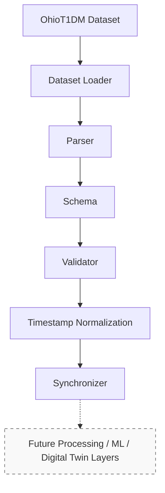

# GlucoTwin Architecture

## Data Pipeline (Sprint 1)

- **Dataset Loader**: Locates dataset files and loads raw formats.
- **Parser**: Converts raw representations into internal structured records.
- **Schema**: Typed internal data models (CGM, Insulin, Meals, Wearables).
- **Validator**: Asserts data integrity, detecting missing values, chronological issues, and patient mix-ups.
- **Timestamp Normalization**: Ensures consistent timestamp tracking and timezone alignment.
- **Synchronizer**: Aligns multiple asynchronous streams (CGM, insulin, etc.) into a cohesive timeline.
- **Future Layers**: NOT IMPLEMENTED YET. (Machine Learning, What-If simulation, Digital Twin).
