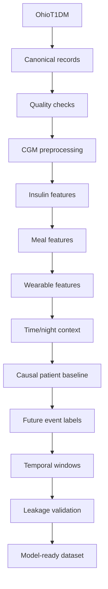

# GlucoTwin Data Pipeline (Sprint 2)

## Architecture

## Feature Engineering Principles
- **Causality:** Features generated at time `T` NEVER use data from > `T`.
- **Rolling Windows:** All rolling feature windows (means, std) use closed backward-looking windows.
- **Interpolation:** CGM data interpolation is strictly limited to 2 gaps (e.g., 10 minutes) maximum. 

## Research Event Labels
- Target Horizons: 30 minutes, 60 minutes.
- Defined as: `future_hypoglycemia_30m = 1` if glucose crosses < 70 mg/dL in `(T, T + 30m]`.
- Severe Hypoglycemia: < 54 mg/dL.
- Nocturnal Hypoglycemia: Combines a clock-based (or explicit) night indicator with the future crossing labels.

## Data Splits
Data splits are evaluated chronologically using a straightforward time-aware split to ensure no future time leaks into the test sets.
